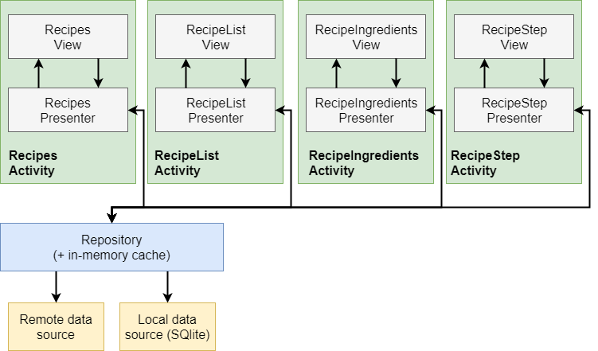
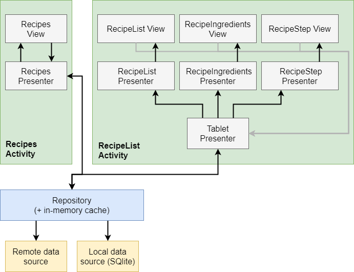

# Baking App
Udacity Nanodegree Project - Advanced Android Development

### Code Structure
This project uses a **MVP** architecture,
The app consists of four UI screens:
- Recipes - a list of all recipes available on the server.
- RecipeList - a master list of a recipe's ingredients and steps.
- RecipeStep - the details of a single step of a recipe.
- RecipeIngredients - a list of all ingredients of a single recipe.

#### Phone mode


#### Tablet mode


### How To Test
All the tests are under the ```mock``` flavor, in order to use controlled values 
and to be independent of the server.

### To-Dos
- Improve network error handling.
- Improve app and widget UI and UX.
- Increase tests coverage.

### Images Credits
- https://www.flaticon.com/packs/food-desserts-2